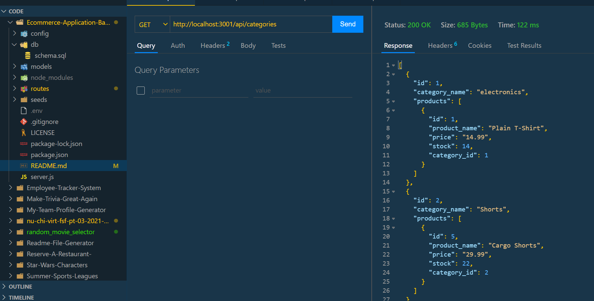
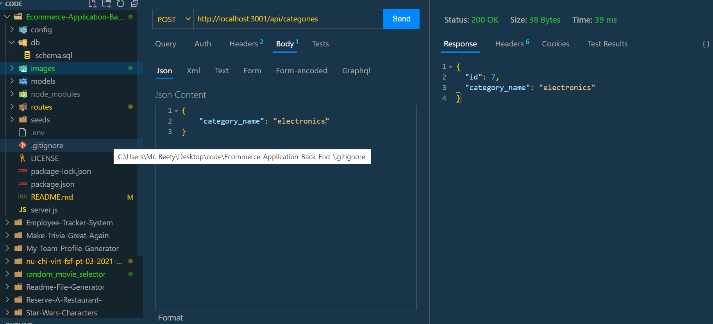
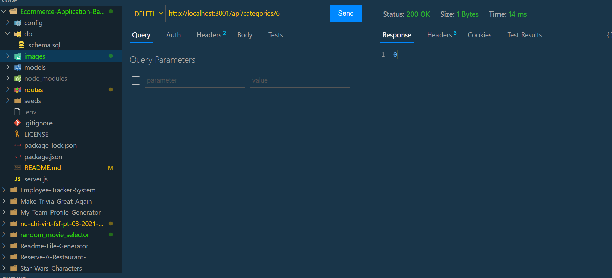

# E-commerce-Application(Back-End)

Finished homework assignment for week 13: E-Commerce Application (Back-End).

The objective of this week's assignment was to modify starting code to create the back end of an E-commerce retail site.

The application will allow a user to interact with the command-line and add a schema and seed the information into the MySQL database. The user can invoke the application by running the npm run start command in the terminal which will start the server and allow the Sequelize models to sync to the MySQL database.

The user can then use API GET routes to receive the data in the categories, products, or tags tables in the database. You can also use the API POST, PUT, or DELETE routes to create, update, or delete data from the database.

Technologies used: - Javascript - Dotenv - Node - Inquirer - Express - My SQL - My SQL Workbench - Sequelize

Github URL:

https://github.com/trevorwiegand92/Ecommerce-Application-Back-End-

Video URL:

https://drive.google.com/file/d/1lsGGLoAre5Ix3MRmiKVWIUdbuRDDuatG/view

Screenshots:

